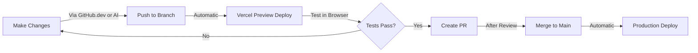

# Cloud-Only Development Workflow 🌥️

## NO LOCAL DEVELOPMENT - EVER!

This project uses a **100% cloud-based workflow**. No local development environment needed or wanted.

## Why Cloud-Only?

1. **Consistency**: Everyone tests in the same environment (Vercel)
2. **Simplicity**: No local setup, dependencies, or version conflicts
3. **Security**: API keys and secrets stay in Vercel, never local
4. **Accessibility**: Work from any device with a browser

## How to Make Changes

### Option 1: GitHub Web Editor (Recommended)
1. Go to https://github.com/Cbiz17/poppy-idea-engine
2. Press `.` (period) or change URL to `github.dev`
3. Edit files directly in browser
4. Create branch and commit
5. Vercel auto-deploys preview

### Option 2: AI Assistant (Claude/ChatGPT)
1. Give AI the GitHub token
2. Tell it what changes to make
3. AI creates branch and commits
4. Test in Vercel preview

### Option 3: GitHub Codespaces (Full IDE)
1. Click "Code" → "Codespaces"
2. Full VS Code in browser
3. No local install needed

## The Workflow



## Environment Variables

All environment variables are stored in Vercel:
- Go to: https://vercel.com/cbiz17/poppy-idea-engine/settings/environment-variables
- Never store `.env` files locally
- Never commit secrets to repo

## Testing

- **Preview URLs**: `https://poppy-idea-engine-[branch-name]-cbiz17.vercel.app`
- **Production**: `https://poppy-idea-engine.vercel.app`
- Test everything in preview before merging

## What NOT to Do

❌ Clone the repository locally  
❌ Run `npm install` or `npm run dev`  
❌ Use GitHub Desktop  
❌ Store any `.env` files locally  
❌ Test on localhost  

## Quick Start for New Contributors

1. **Fork the repo** (if not a collaborator)
2. **Press `.`** to open github.dev
3. **Make your changes**
4. **Commit to a new branch**
5. **Check Vercel preview**
6. **Open a PR**

## Removing Local Repository

If you have a local clone, delete it:
```bash
rm -rf ~/path/to/poppy-idea-engine
```

And remove from GitHub Desktop if installed.

## Questions?

This is the way. No exceptions. The cloud is your development environment.
