# Database Table Interdependencies & Intelligence

## 🕸️ Dependency Graph

```mermaid
graph TD
    %% Core Tables
    AUTH[auth.users] -->|id| PROF[profiles]
    AUTH -->|user_id| IDEAS[ideas]
    AUTH -->|user_id| CONV[conversations]
    AUTH -->|user_id| MSG[conversation_messages]
    
    %% Ideas Dependencies
    IDEAS -->|branched_from_id| IDEAS
    IDEAS -->|idea_id| IDH[idea_development_history]
    IDEAS -->|idea_id| CONVLINK[conversations.idea_id]
    IDEAS -->|idea_id| CC[conversation_continuity]
    IDEAS -->|idea_id| IDS[idea_discovery_stats]
    IDEAS -->|idea_id| IL[idea_likes]
    IDEAS -->|idea_id| IC[idea_comments]
    IDEAS -->|idea_id| ICONT[idea_contributors]
    IDEAS -->|original_idea_id| IR[idea_remixes]
    IDEAS -->|idea_id| IS[idea_shares]
    
    %% Conversation Dependencies
    CONV -->|conversation_id| MSG
    CONV -->|conversation_id| MF[message_feedback]
    CONV -->|conversation_id| CO[conversation_outcomes]
    CONV -->|conversation_id| UA[user_actions]
    CONV -->|conversation_id| IDH
    CONV -->|original_conversation_id| CC
    CONV -->|conversation_id| SSS[smart_save_suggestions]
    
    %% Message Dependencies
    MSG -->|message_id| MF
    MSG -->|message_id| SSS
    
    %% A/B Testing Dependencies
    ABT[ab_tests] -->|test_id| UTA[user_test_assignments]
    ABT -->|test_id| ABR[ab_test_results]
    
    %% Gamification Dependencies
    MF -->|message_feedback_id| FR[feedback_rewards]
    AUTH -->|user_id| DFS[daily_feedback_streaks]
    AUTH -->|user_id| UA_ACH[user_achievements]
    
    %% Styling
    classDef core fill:#2ecc71,stroke:#27ae60,stroke-width:3px
    classDef active fill:#3498db,stroke:#2980b9,stroke-width:2px
    classDef partial fill:#f39c12,stroke:#e67e22,stroke-width:2px
    classDef unused fill:#e74c3c,stroke:#c0392b,stroke-width:2px
    
    class AUTH,PROF,IDEAS,CONV,MSG core
    class MF,UA,IDH,ABT,UTA,CC active
    class IDS,IL,CO,SSS,DFS partial
    class IC,ICONT,IR,IS,FR,UA_ACH,ABR unused
```



## 🧠 Database Intelligence (Functions & Triggers)

### 1. **Auto-Profile Creation**
```sql
Trigger: on_auth_user_created
Function: handle_new_user()
Purpose: Automatically creates profile when user signs up
```

### 2. **Vector Search Functions**
```sql
Function: match_ideas(query_embedding, threshold, count)
- Semantic search on ideas using cosine similarity
- Returns ideas with similarity scores
- Used for: Finding related ideas, smart continuation

Function: match_conversation_messages(query_embedding, user_id, threshold, count)
- Search through conversation history
- User-scoped for privacy
- Used for: Context retrieval, pattern matching

Function: match_learning_patterns(query_embedding, threshold, count)
- Find relevant AI behavior patterns
- Used for: Dynamic prompt enhancement
```

### 3. **Statistical Analysis**
```sql
Function: analyze_conversation_patterns(user_id)
- Aggregates user conversation behaviors
- Returns: pattern types, counts, satisfaction scores
- Used for: Personalization

Function: get_user_feedback_gamification_data(user_id)
- Complex aggregation of feedback stats
- Returns: points, achievements, streaks
- Used for: Gamification dashboard
```

### 4. **A/B Testing Intelligence**
```sql
Function: get_user_test_variant(user_id, test_type)
- Determines which test variant a user should see
- Ensures consistent experience
- Used for: Prompt variations

Function: get_dynamic_system_prompt(user_id)
- Selects appropriate AI prompt based on tests
- Falls back to active prompts
- Used for: Every AI interaction
```

### 5. **Idea Development Tracking**
```sql
Trigger: update_idea_count_trigger
Function: update_idea_development_count()
- Maintains denormalized development_count
- Updates last_activity timestamp
- Performance optimization

Function: get_idea_history_tree(idea_id)
- Recursive CTE for version tree
- Returns: branching history with paths
- Used for: Version visualization

Function: get_idea_stats(user_id)
- Comprehensive idea analytics
- Returns: counts, categories, trends
- Used for: User dashboard
```

### 6. **Social Feature Intelligence**
```sql
Trigger: update_comment_stats, update_like_stats, update_remix_stats
Function: update_idea_discovery_stats()
- Auto-maintains discovery statistics
- Increments/decrements counts
- Used for: Public idea metrics

Function: calculate_trending_score(metrics, created_at)
- Algorithm for trending ideas
- Time decay: 5% per day
- Weighted: views(1x), likes(3x), comments(5x), remixes(10x)
```

### 7. **Gamification Automation**
```sql
Trigger: on_feedback_created
Function: handle_new_feedback()
- Awards points based on feedback quality
- Updates user stats and streaks
- Checks for new achievements
- Creates reward records

Function: update_user_feedback_stats(user_id, points)
- Maintains streak calculations
- Updates level progression
- Handles daily streak records

Function: check_and_award_achievements(user_id)
- Evaluates achievement criteria
- Awards: first-feedback, feedback-10, streak-3, etc.
- Returns newly unlocked achievements
```

## 🔗 Critical Interdependencies

### 1. **User Deletion Cascade**
When a user is deleted, CASCADE removes:
- Profile → Ideas → All idea-related data
- Conversations → Messages → Feedback
- All user actions and test assignments
- All gamification data

### 2. **Idea Deletion Impact**
Deleting an idea cascades to:
- All development history
- All comments and likes
- Discovery statistics
- But NOT remixes (SET NULL for attribution)

### 3. **Conversation Deletion**
Removes:
- All messages in that conversation
- All feedback on those messages
- Continuity tracking
- Save suggestions

## 📊 Data Flow Patterns

### 1. **Feedback Learning Loop**
```
User Action → message_feedback → learning_patterns
     ↓              ↓                    ↓
user_actions → analyze_patterns → dynamic_prompts
     ↓                                   ↓
ab_tests ← test_assignments ← improved_experience
```

### 2. **Idea Evolution Flow**
```
conversation → detect_continuation → idea_development_history
     ↓               ↓                        ↓
messages → smart_save → ideas → branching/versioning
```

### 3. **Social Engagement Flow**
```
ideas (public) → idea_discovery_stats
  ↓                ↓         ↓
likes         comments   remixes
  ↓                ↓         ↓
trending_score calculation → discovery feed
```

## 🚨 Critical Observations

### 1. **Orphaned Data Risks**
- `old_conversations_backup` has no constraints
- `ab_test_results` table exists in types but not migrations
- `dev_logs` has minimal constraints

### 2. **Performance Bottlenecks**
- Vector searches without proper indexes
- Discovery stats triggers fire on every interaction
- Recursive CTEs for history trees could be slow

### 3. **Data Integrity Issues**
- No validation on JSON fields
- Feedback can reference non-existent messages
- A/B test assignments lack expiration

### 4. **Unused Intelligence**
- Complex gamification logic never triggered
- Trending algorithm calculates but isn't displayed
- Smart save detection has no UI

## 🎯 Recommendations

### Immediate Actions
1. **Add Missing Indexes**: Vector columns need HNSW indexes
2. **Clean Orphaned Data**: Remove old_conversations_backup
3. **Validate Constraints**: Add CHECK constraints on JSON fields

### Architecture Improvements
1. **Consolidate Feedback**: Merge outcome tracking into feedback
2. **Simplify Sharing**: Remove complex permissions for MVP
3. **Defer Gamification**: Remove until user base justifies it

### Future Considerations
1. **Partitioning**: Partition messages by date for scale
2. **Materialized Views**: Pre-calculate trending scores
3. **Archive Strategy**: Move old conversations to cold storage